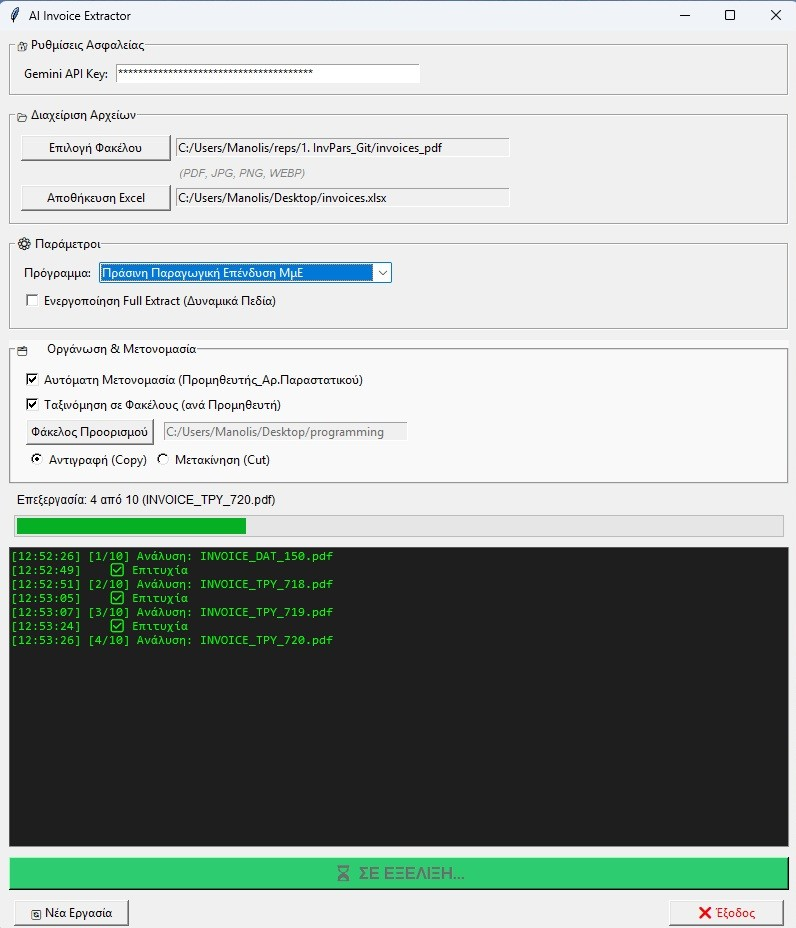
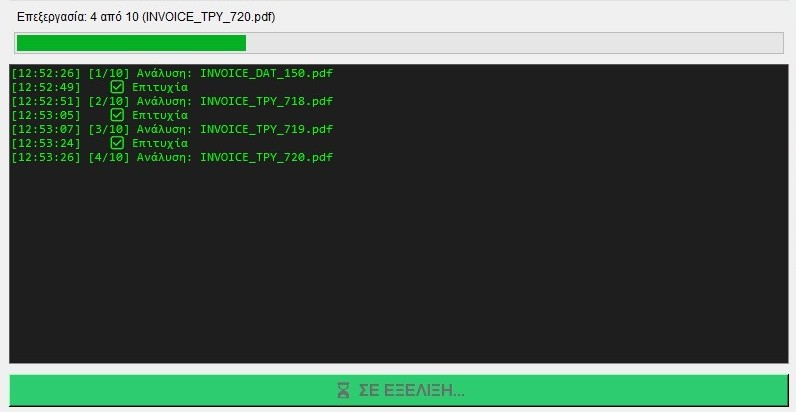

# 📄 AI Invoice Parser  
## Εφαρμογή εξαγωγής δεδομένων από τιμολόγια με χρήση τεχνολογίας AI

---

# 📑 Πίνακας Περιεχομένων
1. [Εισαγωγή](#εισαγωγή)
2. [Κύρια Χαρακτηριστικά](#-κύρια-χαρακτηριστικά)
3. [Απαιτήσεις Συστήματος](#-απαιτήσεις-συστήματος)
4. [Εγκατάσταση](#-εγκατάσταση)
5. [Διεπαφή Χρήστη (GUI)](#-διεπαφή-χρήστη-gui)
   - [1. Ρυθμίσεις API](#1-ρυθμίσεις-api)
   - [2. Επιλογή Αρχείων](#2-επιλογή-αρχείων)
   - [3. Παράμετροι Εξαγωγής](#3-παράμετροι-εξαγωγής)
   - [4. Οργάνωση & Μετονομασία Αρχείων](#4-οργάνωση--μετονομασία-αρχείων)
   - [5. Πρόοδος & Καταγραφή (Logs)](#5-πρόοδος--καταγραφή-logs)
   - [6. Κουμπιά Ενεργειών](#6-κουμπιά-ενεργειών)
6. [Λειτουργίες της Εφαρμογής](#-λειτουργίες-της-εφαρμογής)
7. [Παραγόμενο Αρχείο Excel](#-παραγόμενο-αρχείο-excel)
8. [Screenshots](#-screenshots)
9. [Troubleshooting](#-troubleshooting)
10. [Συχνές Ερωτήσεις (FAQ)](#-συχνές-ερωτήσεις-faq)
11. [Γνωστά Όρια & Τεχνικές Παρατηρήσεις](#-γνωστά-όρια--τεχνικές-παρατηρήσεις)
12. [Μελλοντικές Βελτιώσεις](#-μελλοντικές-βελτιώσεις)
13. [Άδεια Χρήσης](#-άδεια-χρήσης)

---

# 🔍 Εισαγωγή
Η εφαρμογή **AI Invoice Parser** είναι ένα εργαλείο γραφικού περιβάλλοντος (GUI) σε Python, το οποίο χρησιμοποιεί το **Google Gemini AI** για την ανάλυση τιμολογίων και την εξαγωγή δομημένων δεδομένων σε αρχείο **Excel (.xlsx)**.

Υποστηριζόμενοι τύποι αρχείων:
- PDF  
- JPG / JPEG  
- PNG  
- WEBP  

Η εξαγωγή δεδομένων περιλαμβάνει ενδεικτικά τα παρακάτω πεδία:
- Ημερομηνία παραστατικού  
- Προμηθευτής & ΑΦΜ  
- Αριθμός παραστατικού  
- Περιγραφή  
- Καθαρή αξία, ΦΠΑ, Τελική αξία  
- MARK (MyData)  
- SERIAL Number  
- Κρατήσεις / Χαρτόσημα / Λοιπά έξοδα  
- Σχετικό παραστατικό  
- Σημεία φόρτωσης & προορισμού  
- Κατηγοριοποίηση δαπάνης (ΕΣΠΑ – προαιρετικό)  
- Δυναμικά πεδία (Full Extract)  

---

# 🚀 Κύρια Χαρακτηριστικά

### ✔ Εξαγωγή δεδομένων με AI  
Χρήση του Google Gemini για επιστροφή δομημένου JSON.

### ✔ Κατηγοριοποίηση δαπανών ΕΣΠΑ (προαιρετική)  
Υποστηρίζονται ενδεικτικά:
- **Πράσινη Παραγωγική Επένδυση ΜμΕ**  
- **Βασικός Ψηφιακός Μετασχηματισμός ΜμΕ**

### ✔ Full Extract Mode  
Αναζήτηση *όλων* των πεδίων που εμφανίζονται στο τιμολόγιο.  
Προσθήκη δυναμικών στηλών στο Excel με ελληνικές επικεφαλίδες.

### ✔ Αυτόματη μετονομασία αρχείων  
Παράδειγμα:
```
ΠΡΟΜΗΘΕΥΤΗΣ_ΑΡΠΑΡΑΣΤΑΤΙΚΟΥ.jpg
```

### ✔ Αυτόματη ταξινόμηση σε φακέλους  
Ομαδοποίηση ανά προμηθευτή, με επιλογή **Copy** ή **Move**.

### ✔ Αρχείο Excel με μορφοποίηση  
- Μετατροπή ημερομηνιών  
- Μορφοποίηση ποσών  
- Επισήμανση αποτυχημένων εγγραφών  

---

# 💻 Απαιτήσεις Συστήματος
- Windows 10/11  
- Python 3.10+  
- Ενεργό Google Gemini API Key  

---

# 📦 Εγκατάσταση
1. Εγκατάσταση βιβλιοθηκών:
```bash
pip install google-generativeai pandas openpyxl pillow
```

2. Εκτέλεση:
```bash
python invoice_parser_3.py
```

---

# 🖥 Διεπαφή Χρήστη (GUI)

## 1. Ρυθμίσεις API
Εισαγωγή του Google Gemini API Key.  
Αποθηκεύεται σε `settings.json`.

---

## 2. Επιλογή Αρχείων
- Φάκελος τιμολογίων  
- Αρχείο Excel εξόδου  

Υποστηριζόμενοι τύποι:
```
PDF, JPG, JPEG, PNG, WEBP
```

---

## 3. Παράμετροι Εξαγωγής

### 🔹 Επιλογή Προγράμματος
- Χωρίς κατηγοριοποίηση  
- Πράσινη Παραγωγική Επένδυση  
- Βασικός Ψηφιακός Μετασχηματισμός  

### 🔹 Full Extract
Προσθέτει όλα τα δυνατά πεδία που εντοπίζει η AI.

---

## 4. Οργάνωση & Μετονομασία Αρχείων

### ✔ Μετονομασία  
Εφαρμόζεται μόνο σε επιτυχημένα τιμολόγια.

### ✔ Ταξινόμηση  
- Copy  
- Move

---

## 5. Πρόοδος & Καταγραφή (Logs)
Εμφάνιση:
- Προόδου  
- Τρέχοντος αρχείου  
- Μηνυμάτων AI  
- Σφαλμάτων  
- Ενεργειών (rename / move / copy)

---

## 6. Κουμπιά Ενεργειών
- 🚀 Εκκίνηση  
- 🔄 Νέα Εργασία  
- ❌ Έξοδος  

---

# ⚙ Λειτουργίες της Εφαρμογής
Ενδεικτικά πεδία JSON:

- `date`  
- `supplier_name`  
- `supplier_vat`  
- `invoice_number`  
- `description`  
- `net_value`  
- `vat_value`  
- `total_amount`  
- `mark_code`  
- `serial_number`  
- `extra_charges`  
- `related_document`  
- `loading_place`  
- `destination_place`  
- `category_code`  
- `notes`  
- `dynamic_fields`  

---

# 📊 Παραγόμενο Αρχείο Excel
Η εφαρμογή:

- Δημιουργεί στημένες στήλες  
- Μορφοποιεί ποσά  
- Μετατρέπει ημερομηνίες  
- Χρωματίζει σφάλματα  
- Προσθέτει dynamic fields  

---

# 🖼 Screenshots

### 1️⃣ Κεντρικό GUI  


### 2️⃣ Ρυθμίσεις API  


### 3️⃣ Επιλογή Φακέλου Εισαγωγής  


### 4️⃣ Ρυθμίσεις Οργάνωσης  


### 5️⃣ Πρόοδος & Καταγραφή  


### 6️⃣ Κουμπιά Ενεργειών  


---

# 🛠 Troubleshooting

### ❌ API Key Error  
Ελέγξτε ότι το κλειδί είναι σωστό και ενεργό.

### ❌ 429 Too Many Requests  
Περιορισμός Google — μειώστε τα batches.

### ❌ Μη έγκυρο JSON  
Κακή εικόνα ή δυσανάγνωστο παραστατικό.

### ❌ Timeout  
Αδύναμη σύνδεση ή μεγάλα αρχεία.

### ❌ Excel Permission Error  
Το Excel αρχείο είναι ανοιχτό — κλείστε το.

---

# ❓ FAQ

### Μπορώ να επεξεργαστώ εικόνες;  
Ναι.

### Χάνονται τα αρχεία;  
Μόνο με Move.

### Dynamic fields πάντα ενεργά;  
Μόνο με Full Extract.

---

# ⚠ Γνωστά Όρια

- Η ποιότητα OCR εξαρτάται από την Google.  
- Μεγάλα αρχεία = μεγαλύτεροι χρόνοι.  
- Τα filenames καθαρίζονται από απαγορευμένους χαρακτήρες.  

---

# 🔮 Μελλοντικές Βελτιώσεις
- Drag & drop  
- Παράλληλη επεξεργασία  
- Custom mapping  
- OCR fallback  

---

# 📜 Άδεια Χρήσης
Το έργο διατίθεται για προσωπική χρήση.
